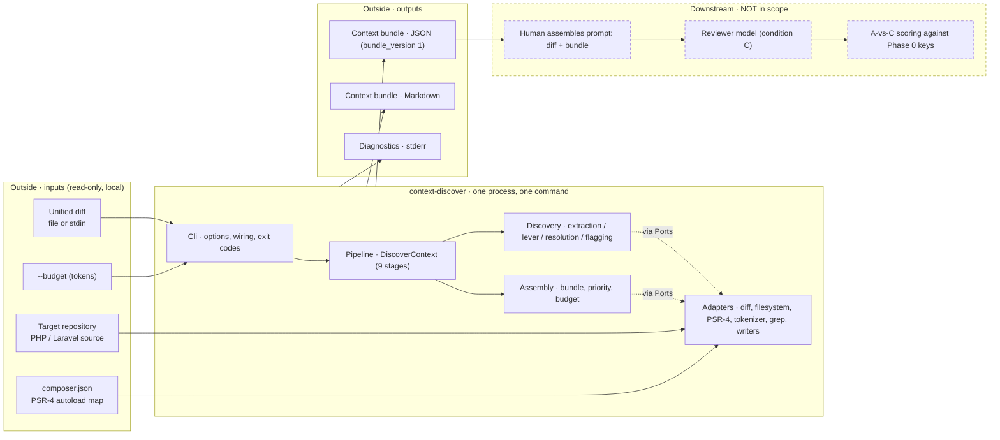
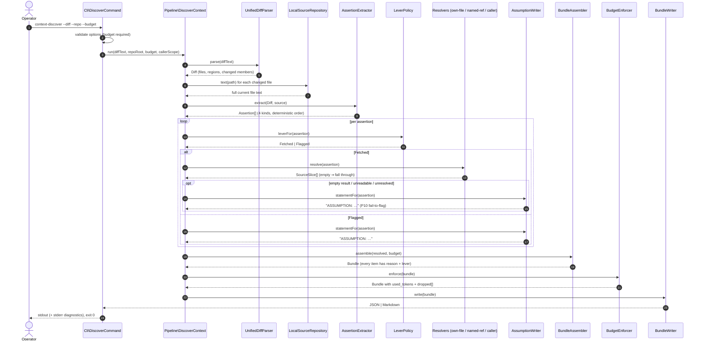
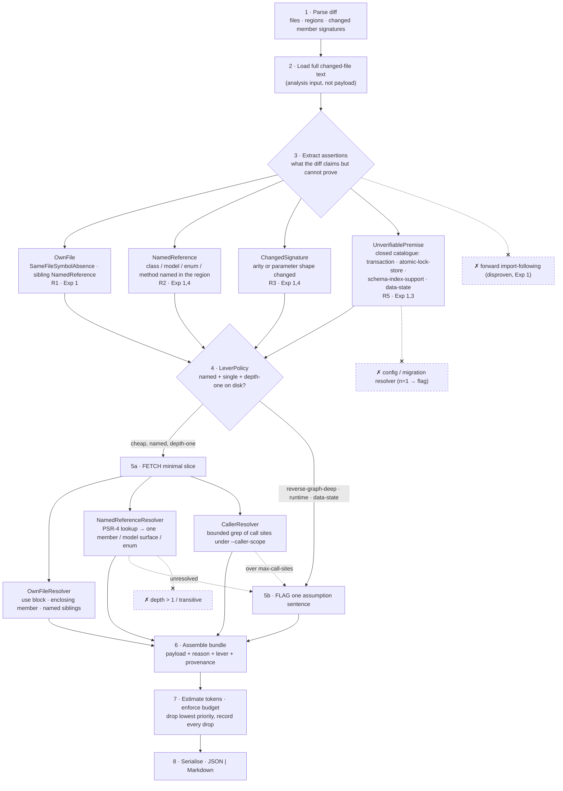
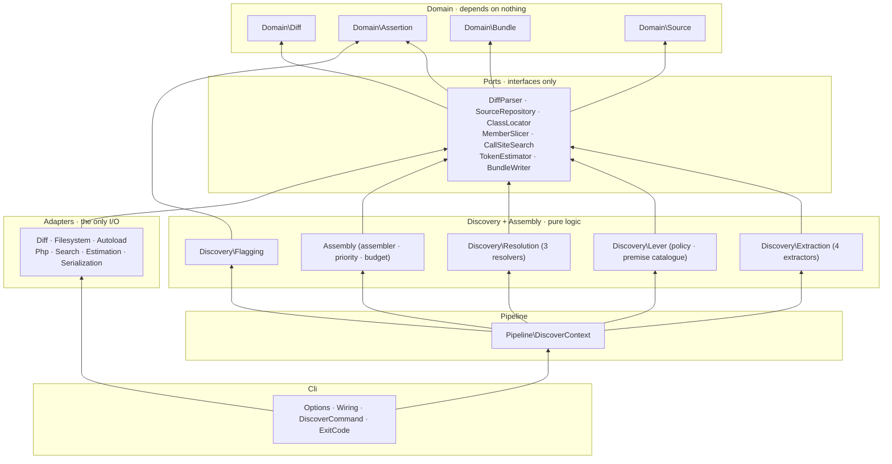

# 04 · Diagrams

Mermaid source, so the diagrams live in version control and diff. Four diagrams, exactly as
required: high-level architecture, request flow, Context Discovery pipeline, module dependency.

## 1 · High-level architecture

The dashed region is deliberately outside the boundary: no LLM call inside the tool (X5), no
judgement (P6, X4), no scoring (Phase 2).

## 2 · Request flow (one invocation)

No step calls the network, spawns a process, writes into the repository, or loops back to an
earlier step.

## 3 · Context Discovery pipeline (the nine responsibilities)

The crossed nodes are the exclusions, drawn so the diagram shows *where* each one would have
attached — and does not.

## 4 · Module dependency

Arrows point at what a module depends on. Two rules make the graph acyclic and enforceable:
`Discovery`/`Assembly`/`Pipeline` never name an `Adapters` class, and `Cli\Wiring` is the only
place a concrete adapter appears.
